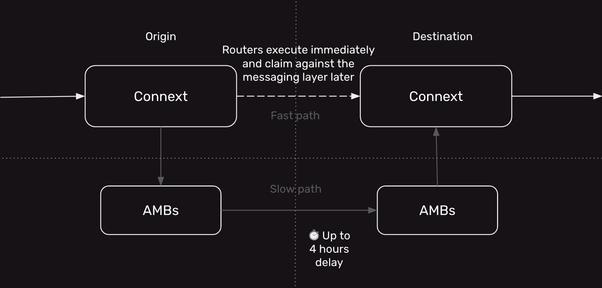

# What is Connext?

Connext is a decentralized interoperability protocol to empower developers to build fully-expressive, secure cross-domain apps.
With its toolkit, Connext powers fast, secure, trust minimized bridging between blockchains and rollups.

## What is a Bridge?

A bridge (or interoperability network) is a system that relays assets and/or data between blockchains.

## What does the Connext flow look like?

In this diagram we can observe two domains, "origin" and "destination", and two paths, "fast" and "slow".

The intention of the user is to bridge tokens from the origin domain to the destination domain, and have access to fast liquidity.
Connext solves this for him, as routers are taking the liquidity risk and will be reimbursed via the slow path by the AMB bridge.

If the user is bridging data, or if the call needs to be authenticated by the caller, the briding operation will always go through the slow path.

## What can you build with Connext?

Some example use cases:

- Execute the outcome of **DAO votes** across chains
- Lock-and-mint or burn-and-mint **token bridging**
- **Aggregate DEX liquidity** across chains in a single seamless transaction
- Crosschain **vault zaps** and **vault strategy management**
- **Lend funds** on one chain and borrow on another
- Bringing **UniV3 TWAPs** to every chain without introducing oracles
- **NFT bridging** and chain-agnostic NFT marketplaces
- **Store data on Arweave/Filecoin** directly from within an Ethereum smart contract

## What's the architecture of the protocol?

The Connext architecture can be seen as a layered system, as follows:

| Layer                   | Protocol/Stakeholders             |
| ----------------------- | --------------------------------- |
| `Application Layer`     | `Crosschain Applications (xApps)` |
| `Liquidity Layer`       | `NXTP`                            |
| `Messaging Layer`       | `AMBs, etc`                       |
| `Transport Layer`       | `Connext Routers`                 |

Let's take a closer look at some of these:

1. xApps are applications built by developers like you!
2. NXTP is a *liquidity* layer and a *developer interface* on top of an optimisitic briding protocol.
3. Our messaging layer is currently based off of multiple AMBs. We plan to migrate to an optimistic bridge mechanism in the near future.
4. Routers watch AMB messages and “short-circuit” them by immediately executing calls/providing liquidity on the destination chain. **This removes the AMB 4 hour minute latency in all user-facing cases.**

A simple mental model is to think of Connext as the liquidity layer to an AMB messaging layer. Connext and AMBs, as well as optimistic bridges soon, together provide the two halves of the “ideal” solution for interoperability.

## How do tokens reach the end-user on the destination chain?

1. AMMs on each chain enable swapping from the chain’s asset to bridge assets → this ensures users give and receive the assets the expect to on each chain.
2. Connext executes AMB interactions on the destination chain and provides a consolidated interface for devs that abstracts away the complexities of building against AMBs directly.

## How do I interact with Connext?

Developers can call `xCall`, and the protocol will then splits actions between a Liquidity Layer (Connext) and a Messaging Layer.
You can interact with xCall in ways described in the `Send your first xCall` section of this document

## How do I interact with the Connext community?

Find our discord at https://discord.gg/pef9AyEhNz and join the `dev-hub` channel